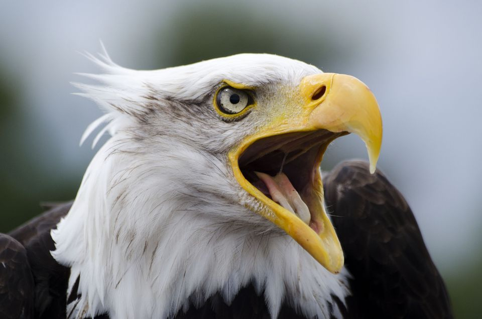
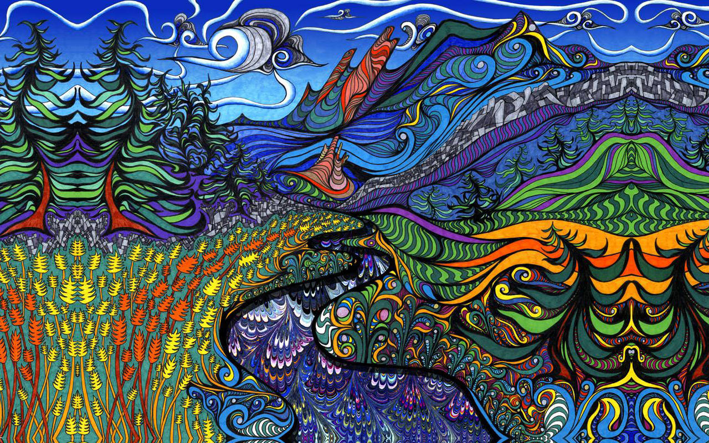
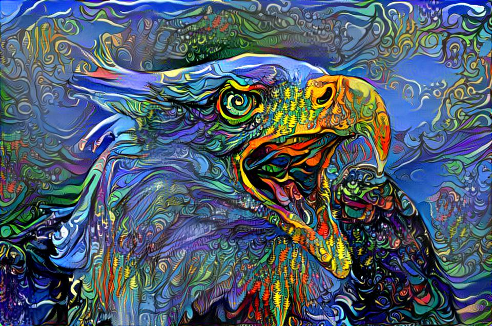
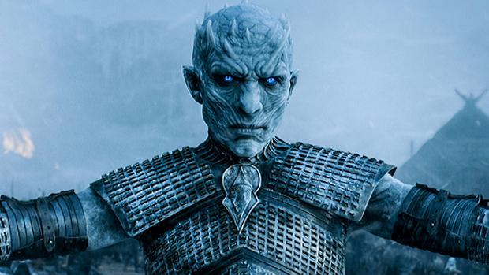
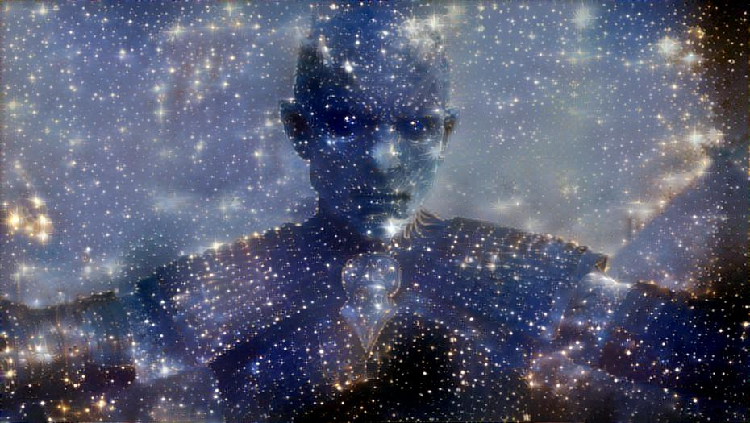

# style_transfer

This is a basic Tensorflow implementation of the papar ["A Neural Algorithm of Artistic Style"](https://arxiv.org/abs/1508.06576). 

**This is a first draft of the commit, I will try to add better documentation, examples and functionality soon**
The algorithm renders an image that keeps the content of one reference image while copying the style of another. For example:

 

 

There's plenty of great explanations on the web regarding how this works so I won't go into detail here... 

## Dependencies:
* [Tensorflow](https://www.tensorflow.org/install/) (version > 1.0)
* [tensorflow-vgg](https://github.com/machrisaa/tensorflow-vgg)

## Usage:
For now there aren’t many controllable parameters through the command line, however it is pretty simple to control everything inside the code.
To run using command line:

`python main.py`

All parameters are optional and have default values:

`--iterations <number of iterations>`, `--out_width <width of output image>`, `--content_name <content file>`, `--style_name <style file>`, `--output_name <output file>`, `--noise_ratio <init image is noise_ratio*noise + (1-noise_ratio)*content_image>`, `--gamma <content/style ratio>`, `--beta <style weight>`, `--theta <tv loss weight>`, `--optimizer <'adam' or 'lbfgs'>`.

## Acknowledgements 
For the trained VGG19 I have used the implementation of [mechrisaa](https://github.com/machrisaa/tensorflow-vgg).

The images are old ones I found on my computer and are probably copyrighted, I assume no copyrights over the images and will try to trace their source soon to add credit.
